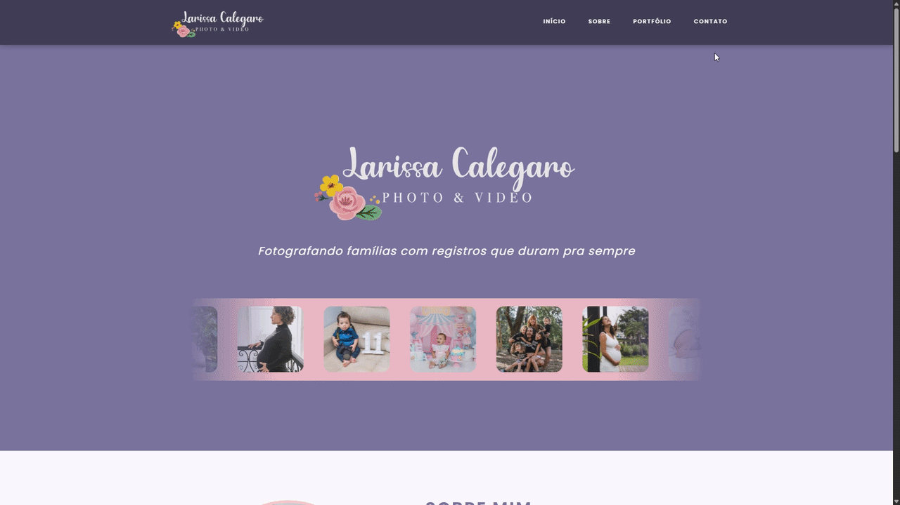
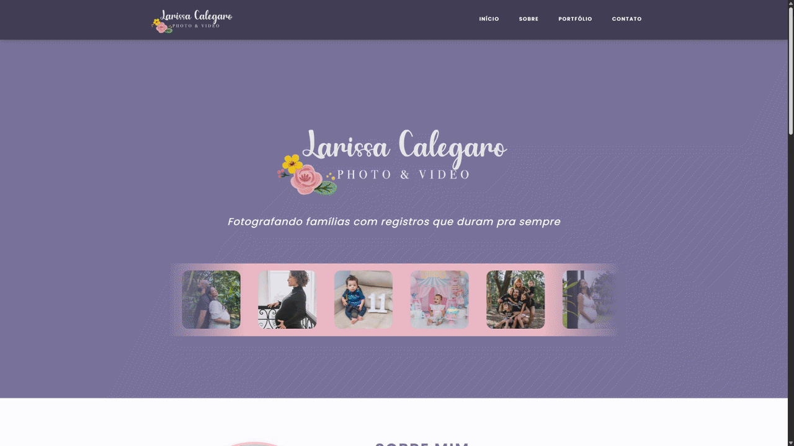
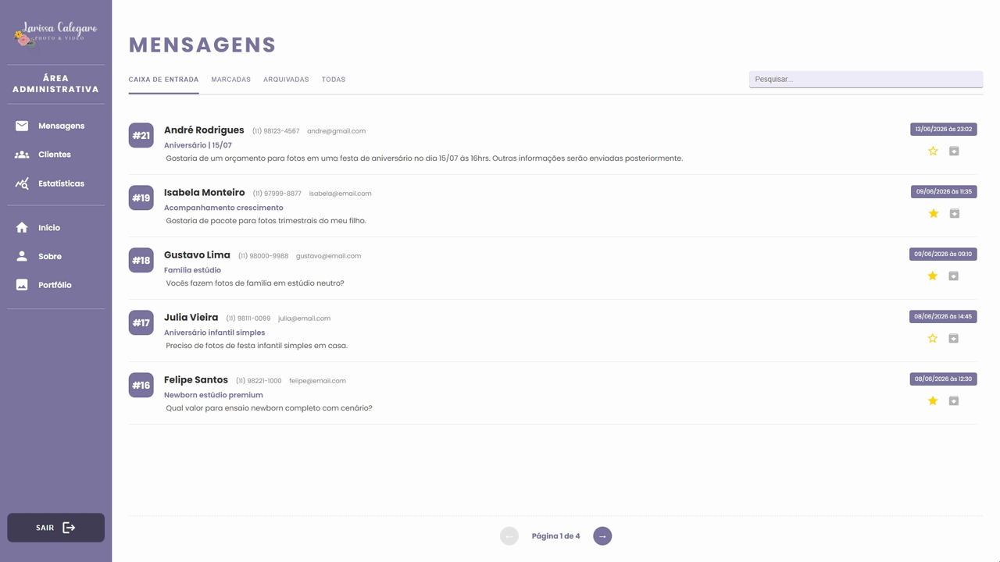
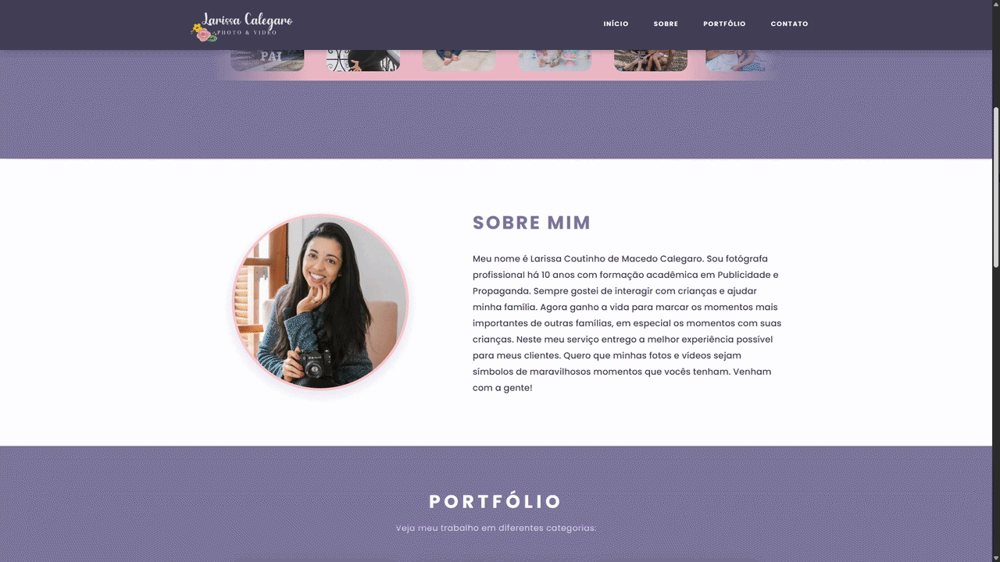
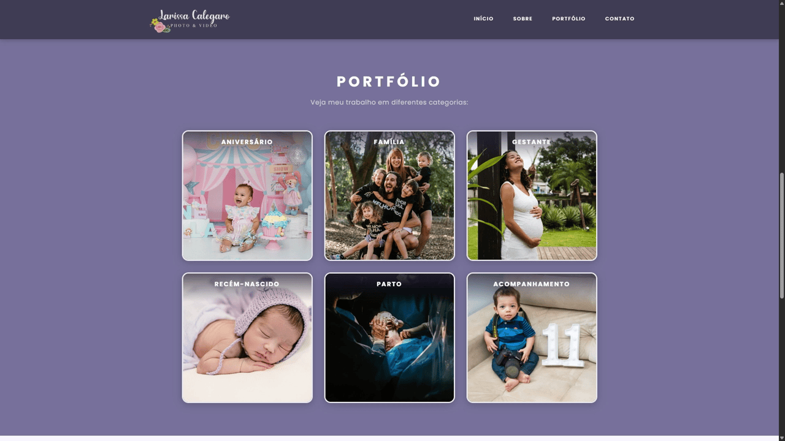
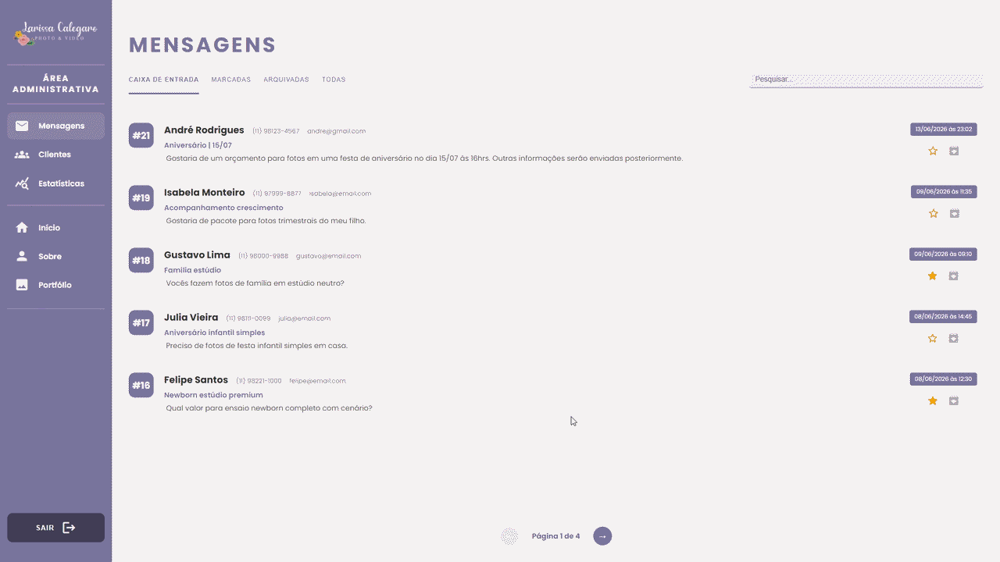

# 📸 Projeto Web — Site Fotográfico - Larissa Calegaro

**Disciplina:** Desenvolvimento de Sistemas Web - Centro Universitário SENAC<br>
**Orientador:** Prof. Bruno de Oliveira

## 👥 Integrantes

- [André Rodrigues](https://github.com/oandredev)
- [André Coutinho](https://github.com/AndreCoutinhom)

---

## 🧠 Visão Geral

Aplicação web completa para um site fotográfico da **Larissa Calegaro**, com separação entre frontend e backend.

- [👉🏼 Demonstração →](#-exemplos-visuais)

---

## 🏗️ Estrutura do Projeto

```
/projeto-fotografico
 ├── /mockup-sql → Código de mockup do SQL para testes previamente estabelecidos, incluindo inserção do admin
 ├── /uploads    → Banco de Imagens (Armazena as imagens, criando relacionamento com os endereços armazenados no banco de dados)
 ├── /node-api   → Backend A (Node.js + Multer (Para imagens))
 ├── /spring-api → Backend B (SpringBoot + Servlet.Multipart)
 └── /angular    → Frontend (Angular)
```

### 🔸 Backend (API - NodeJs | SpringBoot)

- Node.js + Multer (Para gerenciamento de imagens)
- SpringBoot + Servlet Multipart (Para gerenciamento de imagens)
- MySQL
- CRUD de dados
- Regras de negócio

### 🔹 Frontend (Angular)

- Angular
- Interface do usuário
- Consumo da API

---

## ⚙️ Funcionalidades

- Cadastro de fotos
- Listagem de portfólio
- Visualização detalhada
- Upload de imagens, descrição e slogan
- Envio de mensagens
- Dashboards com resumo das informações

---

## ▶️ Como Executar

### 1. Clonar o repositório

```bash
git clone https://github.com/oandredev/projeto-fotografico
cd projeto-fotografico
```

---

### 2. Instalar dependências

#### Backend

```bash
cd node-api
npm install
```

#### Frontend

```bash
cd angular
npm install
```

---

### 3. Executar o projeto

#### 🔹 Backend

##### NodeJs

```bash
cd node-api
npm start
```

##### SpringBoot

Para rodar o projeto em `SpringBoot` abra o projeto no IntelliJ e execute partindo do arquivo `ProjetoFotograficoApplication` e clique em executar

- Para que o Angular utilize essa API, vá até o arquivo `environment.ts` e troque para porta da API do SpringBoot, inicialmente está como `3010`

#### 🔹 Frontend

```bash
cd angular
npx ng serve --open
```

---

## 🧪 Acesso

- Frontend Angular: [http://localhost:4200](http://localhost:4200)
- API NodeJs (PORTA 3000): [http://localhost:3000](http://localhost:3000)
- API SpringBoot (PORTA 3010): [http://localhost:3010](http://localhost:3010)

**OBS:** As portas informadas e as variavéis de ambientes são as utilizadas como padrão, mas podem ser alteradas nos seguintes arquivos:

- Angular → `environment.ts`
- Node.js → `.env`
- SpringBoot → `application.properties`

📍**LEMBRE-SE**: em um projeto real esses arquivos **NÃO** devem ser públicos por questões de `segurança`.

---

## ⚠️ Observações

- Certifique-se de que o serviço MySQL está rodando (Serviço `MySQL80`)
- Configure credenciais corretamente no `.env`, `environment.ts` e `application.properties`, como (usuario, senha, nome do banco de dados, portas, etc)
- Para alternar entre as APIs (NodeJs e SpringBoot), altere a porta no arquivo [environment.ts](angular\src\app\environment.ts). É recomendado deslogar antes e fazer login após trocar a API, devido as questões de autenticação
- Considere que no primeiro acesso, fotos e textos base não serão exibidos, pois dependem de informações do banco de dados, o qual deve ser inicializado previamente, assim como as inserções das informações devem ser feitas utilizando a área administrativa (Exceto o cadastro da conta na tabela de login, a qual deve ser realizada diretamente pelo MySQL)
  - Desconsidere isso, se tiver feito a inicialização via `mockup` [(Informações adicionais)](/mockup-sql/README.md)

---

## 📸 Exemplos Visuais

### 🏠 Visão Geral

<p></p>

### 🖼️ Navegação por Categorias

<p></p>

### 📩 Formulário de Contato

<p></p>

### 🔐 Login Administrativo

<p></p>

### 📬 Caixa de Entrada de Mensagens

<p></p>

### 📝 Personalização da Seção "Sobre"

<p></p>

### 🖼️ Gerenciamento de Portfólio

<p></p>

### 📊 Dashboard Administrativo

<p></p>
